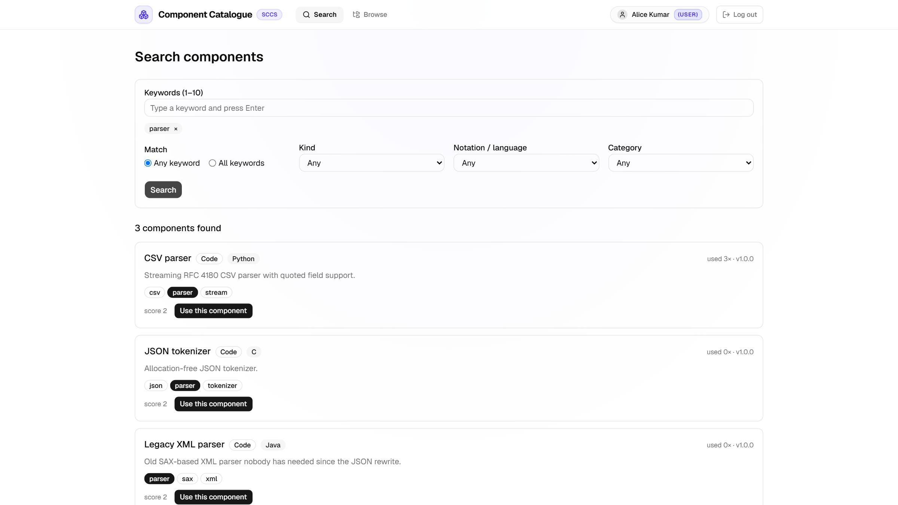
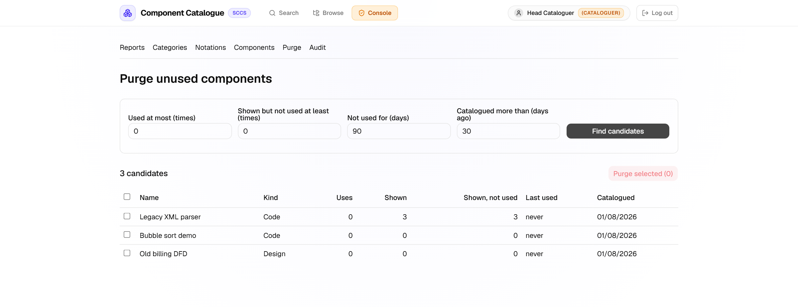

# Software Component Cataloguing System (SCCS)

[](https://github.com/YashIIT0909/SWE_LAB_Assignment/actions/workflows/ci.yml)

A web catalogue of potentially reusable software components. A component is a **design** (UML, ERD,
Structured Design, DFD) or **code** (Java, Python, C, C++, JavaScript, TypeScript). Components are tagged
with keywords, filed in a hierarchical category tree, and found by keyword search or by browsing. The
system counts how often each component is used, and how often it appears in a search without being used,
so a cataloguer can purge the ones nobody needs.

Built for Software Engineering Lab, Assignment 8 (problem: Software Component Cataloguing), IIT (ISM)
Dhanbad, 2026.

|                                                           |                                                            |
| --------------------------------------------------------- | ---------------------------------------------------------- |
|  |  |
| Keyword search with score and matched keywords            | The cataloguer reviews and purges unused components        |

## What it does

| Who                     | Can do                                                                                                                                                                       |
| ----------------------- | ---------------------------------------------------------------------------------------------------------------------------------------------------------------------------- |
| Visitor (not logged in) | Browse the category tree, view components, search by keywords (1 to 10, "any" or "all", filters, ranked results), register or log in                                         |
| User                    | Everything a visitor can, plus **use** a component (updates its usage counters)                                                                                              |
| Cataloguer              | Everything a user can, plus add, edit and delete components, manage keywords, categories and notations, view the usage report and audit log, and **purge** unused components |

- Registration always creates a User. Cataloguer accounts come from the seed script, never from the website.
- Search: a keyword equal to the term scores 2, a keyword starting with a term of 3 or more letters scores 1.
  There is no fuzzy or synonym matching.
- Counters per component: `useCount`, `queryHitCount`, `queryHitNotUsedCount`, `lastUsedAt`. A search adds to
  the hit counters of the components on the returned page; "Use" raises `useCount` and lowers the
  "not used" counter once. Both happen in one database transaction.
- Purge is manual: set criteria, review the candidates, confirm. The server checks again and writes an audit
  entry for every deletion. There is no scheduler.

## Tech stack

| Part     | Technology                                                                                   |
| -------- | -------------------------------------------------------------------------------------------- |
| Web      | Next.js 16 (App Router), React 19, TypeScript, Tailwind CSS 4, shadcn/ui, TanStack Query     |
| API      | Node.js 22, Express 5, TypeScript, zod 4 (validation shared with the web app), JWT, bcryptjs |
| Database | PostgreSQL, Prisma 7                                                                         |
| Tests    | Vitest, Supertest, Playwright with axe-core                                                  |
| Tooling  | npm workspaces, ESLint, Prettier, GitHub Actions                                             |
| Hosting  | Vercel (web app and API as a serverless function), Supabase used only as managed PostgreSQL  |

The API has layers: routes, middleware, controllers, services, Prisma. Only services touch the database.
Diagrams are in [`docs/diagrams`](docs/diagrams).

## Getting started

You need **Node.js 22** (see `.nvmrc`) and a local **PostgreSQL**.

```bash
npm install                                   # also runs prisma generate; needs no .env or database
cp apps/api/.env.example apps/api/.env        # then edit the values (see below)
cp apps/web/.env.example apps/web/.env.local
# create two databases: sccs_dev and sccs_test (if Postgres needs a password over TCP, put it in the URLs)
npm run db:migrate -w @sccs/api               # or db:deploy to only apply the existing migrations
npm run db:seed -w @sccs/api                  # notations, categories, demo components, a cataloguer account
npm run dev                                   # API on :4000, web app on :3000
```

On Windows, if `npm run dev` does not start both, run them in two terminals:
`npm run dev -w @sccs/api` and `npm run dev -w @sccs/web`.

Open http://localhost:3000. Log in as the seeded cataloguer with `SEED_CATALOGUER_EMAIL` and
`SEED_CATALOGUER_PASSWORD` from your `apps/api/.env` (the example file uses `cat@sccs.local` and
`changeme123`; these are dummy values, change them for anything public). Register a new account to see the
user view.

### Environment variables

Names only; real values live in untracked `.env` files. The `.env.example` files show the format.

| Variable                                            | Where | Notes                                                                              |
| --------------------------------------------------- | ----- | ---------------------------------------------------------------------------------- |
| `DATABASE_URL`                                      | API   | Connection used at runtime (pooled URL on Supabase)                                |
| `DIRECT_URL`                                        | API   | Direct connection, used by `prisma migrate`                                        |
| `DATABASE_URL_TEST`                                 | API   | A **separate** database for the tests; they migrate and write to it                |
| `JWT_SECRET`                                        | API   | **Required.** The API refuses to issue tokens without it. Use a long random string |
| `WEB_ORIGIN`                                        | API   | Allowed browser origins, comma separated. If unset, every origin is allowed        |
| `PORT`                                              | API   | Default 4000                                                                       |
| `SEED_CATALOGUER_EMAIL`, `SEED_CATALOGUER_PASSWORD` | API   | Account created by the seed script                                                 |
| `NEXT_PUBLIC_API_URL`                               | Web   | API base URL, for example `http://localhost:4000/api/v1`                           |

## Commands

Run from the repository root.

```bash
npm run lint
npm run format:check
npm run typecheck
npm test                  # unit and integration tests with coverage; needs DATABASE_URL_TEST
npm run test:e2e          # Playwright end-to-end tests; needs a seeded database
npm run build             # production builds
```

- Install the browser for the end-to-end tests once with `npx playwright install chromium`.
- **The purge end-to-end test deletes a component.** Run it only against a local database, never against a
  live one, and run `npm run db:seed -w @sccs/api` afterwards to restore the demo data.
- On Windows, start the API (:4000) and the web app (:3001, `npx next dev -p 3001` in `apps/web`) yourself;
  Playwright reuses running servers.

Current results: 61 unit and integration tests and 9 end-to-end scenarios, all passing; about 98% line
coverage of the API. CI runs lint, format check, type check, migrations, tests, the web build, the seed and
the end-to-end suite on every push.

## Project structure

```
apps/api        Express API (src/ routes, middleware, controllers, services), Prisma schema and seed, tests
apps/web        Next.js web app (app/ pages, components/, lib/), Playwright end-to-end tests
packages/shared zod schemas and types used by both apps
docs/           requirements, use cases, design, API, test plan, report, diagrams (start at docs/README.md)
ppt/            material used to rebuild the presentation
CLAUDE.md       short technical summary of the whole system (data model, counter rules, API table)
```

## Documentation

| Document                                       | Content                                                                      |
| ---------------------------------------------- | ---------------------------------------------------------------------------- |
| [`docs/01-SRS.md`](docs/01-SRS.md)             | Functional (FR-1 to FR-27) and non-functional (NFR-1 to NFR-11) requirements |
| [`docs/02-use-cases.md`](docs/02-use-cases.md) | Use cases UC-1 to UC-14 with the use case diagram                            |
| [`docs/04-design.md`](docs/04-design.md)       | Architecture, class and sequence diagrams                                    |
| [`docs/05-api.md`](docs/05-api.md)             | Every endpoint, error codes, security rules                                  |
| [`docs/06-test-plan.md`](docs/06-test-plan.md) | Test strategy and cases T-01 to T-48                                         |
| [`docs/08-report.md`](docs/08-report.md)       | Traceability matrix, results, demo script                                    |
| [`docs/README.md`](docs/README.md)             | Index of all documents                                                       |

## Deployment

The web app and the API are separate Vercel projects; the database is Supabase PostgreSQL. Set these in
Vercel before deploying: for the API `JWT_SECRET`, `DATABASE_URL`, `DIRECT_URL` and `WEB_ORIGIN` (the real URL
of the web app); for the web app `NEXT_PUBLIC_API_URL`. Apply migrations with `prisma migrate deploy`.

## Known limitations

- "Used" is self-reported: the user presses the button.
- The login rate limiter keeps its counter in process memory, so it is not shared between serverless
  instances; the login token is stored in the browser's local storage.
- Search speed was benchmarked for the ranking code only (in process), not under load.
- The web app has no unit tests; accessibility was scanned on the five public pages only.

## Team

Dinesh Krishna, Sankar, Vishesh, Sai Teja, Yash Agarwal, Yash Patidar.

## License

[MIT](LICENSE)
