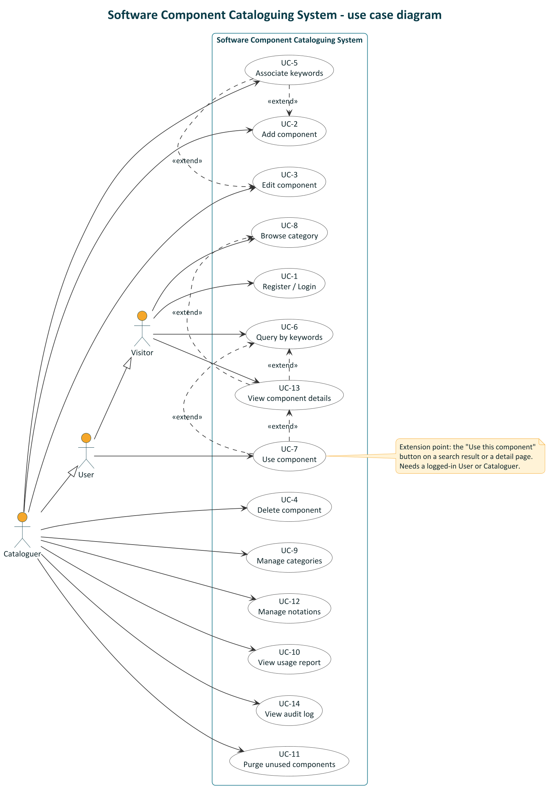

# Use Cases

Actors: **Visitor** (anonymous), **User** (`USER`, logged in), **Cataloguer** (`CATALOGUER`).
A Cataloguer is a specialised User; a User is a logged-in Visitor.

## Use case diagram

Source: `diagrams/use-case.puml` (PlantUML). Notation:

- **Actor generalization** (hollow-triangle arrow): a User is a Visitor who is logged in, and a
  Cataloguer is a User with extra privileges. A Cataloguer can therefore also do UC-7.
- **«extend»** (dashed arrow pointing at the base use case): the extending use case is optional and
  adds behaviour to the base one at an extension point.
  - UC-7 Use component extends UC-6 and UC-13: the "Use this component" button on a search result
    or on a detail page.
  - UC-13 View component details extends UC-6 and UC-8: opening one result or one list entry.
  - UC-5 Associate keywords extends UC-2 and UC-3: keywords are optional when a component is
    created (FR-8), and are edited with the same form.
- There is no «include» in this system. Every use case can be completed on its own.

| Use case | Actors | Requirements |
|---|---|---|
| UC-1 Register / Login | Visitor | FR-13 |
| UC-2 Add component | Cataloguer | FR-2, FR-4, FR-7, FR-8, FR-11 |
| UC-3 Edit component | Cataloguer | FR-7, FR-9 |
| UC-4 Delete component | Cataloguer | FR-10 |
| UC-5 Associate keywords | Cataloguer | FR-11, FR-16 |
| UC-6 Query by keywords | Visitor, User, Cataloguer | FR-14, FR-15, FR-16, FR-18 |
| UC-7 Use component | User, Cataloguer | FR-17, FR-18 |
| UC-8 Browse category | Visitor, User, Cataloguer | FR-25, FR-26, FR-27 |
| UC-9 Manage categories | Cataloguer | FR-23, FR-24 |
| UC-10 View usage report | Cataloguer | FR-19 |
| UC-11 Purge unused components | Cataloguer | FR-20, FR-21 |
| UC-12 Manage notations | Cataloguer | FR-5, FR-6, FR-7 |
| UC-13 View component details | Visitor, User, Cataloguer | FR-3 |
| UC-14 View audit log | Cataloguer | FR-22 |

Every catalogue write (UC-2 to UC-5, UC-9, UC-11, UC-12) also writes an audit row (FR-22).

## UC-1 Register / Login

| | |
|---|---|
| Actors | Visitor (primary) |
| Requirements | FR-13 |
| Preconditions | The visitor is not logged in. |
| Postconditions | The visitor holds a valid JWT and is logged in as `USER` or `CATALOGUER`. |

**Main flow (register)**
1. Visitor opens the Register page and enters name, email and password.
2. System validates input (email format, password >= 8 chars).
3. System checks that the email is not taken, hashes the password, creates a `USER`.
4. System returns a token and the user profile; the client stores the token and shows the home page.

**Main flow (login)**
1. Visitor opens the Login page and enters email and password.
2. System verifies the password hash and returns a token and profile (role may be `CATALOGUER`).

**Alternate flows**
- 2a. Invalid input: system shows field errors (`VALIDATION_ERROR`); flow resumes at step 1.
- 3a. Email already registered: system shows `EMAIL_TAKEN`; flow resumes at step 1.
- Login 2a. Wrong email or password: system shows `INVALID_CREDENTIALS` without saying which is wrong.
- Any role field sent by the client during registration is ignored.

## UC-2 Add component

| | |
|---|---|
| Actors | Cataloguer |
| Requirements | FR-2, FR-4, FR-7, FR-8, FR-11, FR-22 |
| Preconditions | Cataloguer is logged in; at least one category and one notation exist. |
| Postconditions | A new component exists with `useCount = 0` and zeroed hit counters, linked to its keywords; an audit row `COMPONENT_CREATE` is written. |

**Main flow**
1. Cataloguer opens "New component".
2. Cataloguer chooses kind (Design or Code); the notation list is filtered to that kind.
3. Cataloguer enters name, description, notation, category, optional version, author, source URL and content.
4. Cataloguer adds keywords (includes UC-5; autocomplete suggests existing ones).
5. Cataloguer submits. System validates, checks notation kind = component kind, creates the component and keyword links in one transaction, writes an audit row.
6. System shows the new component's detail page.

**Alternate flows**
- 5a. Validation error: fields highlighted, nothing saved.
- 5b. Notation kind differs from component kind: `NOTATION_KIND_MISMATCH`, nothing saved.
- 5c. Category or notation no longer exists: `NOT_FOUND`, nothing saved.

## UC-3 Edit component

| | |
|---|---|
| Actors | Cataloguer |
| Requirements | FR-7, FR-9, FR-22 |
| Preconditions | Cataloguer is logged in; the component exists. |
| Postconditions | Component fields are updated; counters are unchanged; audit row `COMPONENT_UPDATE` written with changed fields. |

**Main flow**
1. Cataloguer opens a component and chooses "Edit".
2. System shows the form pre-filled.
3. Cataloguer changes fields and submits.
4. System validates and saves only the changed fields, writes the audit row, shows the updated detail.

**Alternate flows**
- 3a. Cataloguer cancels: nothing changes.
- 4a. Kind or notation changed so they no longer agree: `NOTATION_KIND_MISMATCH`.
- 4b. Component was deleted meanwhile: `NOT_FOUND`; the UI returns to the list.

## UC-4 Delete component

| | |
|---|---|
| Actors | Cataloguer |
| Requirements | FR-10, FR-22 |
| Preconditions | Cataloguer is logged in; the component exists. |
| Postconditions | The component and its `ComponentKeyword`, `SearchResult` and `UsageEvent` rows are gone; keywords themselves remain; audit row `COMPONENT_DELETE` stores the component's name. |

**Main flow**
1. Cataloguer chooses "Delete" on a component.
2. System asks for confirmation, showing the component name and usage counts.
3. Cataloguer confirms.
4. System deletes the component (cascade) and writes the audit row in one transaction.

**Alternate flows**
- 3a. Cataloguer cancels: nothing changes.
- 4a. Component already deleted: `NOT_FOUND`, list refreshed.

## UC-5 Associate keywords

| | |
|---|---|
| Actors | Cataloguer |
| Requirements | FR-11, FR-16, FR-22 |
| Preconditions | Cataloguer is logged in; the component exists (or is being created in UC-2). |
| Postconditions | The component's keyword set equals the cataloguer's selection; new terms exist as `Keyword` rows; audit row `KEYWORDS_UPDATE`. |

**Main flow**
1. Cataloguer opens the keyword editor of a component.
2. Cataloguer types a term; system suggests existing keywords by prefix (`GET /keywords`).
3. Cataloguer picks a suggestion or adds a new term; repeats as needed; removes unwanted chips.
4. Cataloguer saves. System normalises terms (trim, lowercase, de-duplicate), upserts `Keyword` rows and replaces the links (`PUT /components/:id/keywords`).

**Alternate flows**
- 3a. Quick add of a single term uses `POST /components/:id/keywords`.
- 3b. Quick removal of one chip uses `DELETE /components/:id/keywords/:keywordId`.
- 4a. A term is empty or longer than 50 chars: `VALIDATION_ERROR`.

## UC-6 Query by keywords

| | |
|---|---|
| Actors | Visitor, User, Cataloguer |
| Requirements | FR-14, FR-15, FR-16, FR-18 |
| Preconditions | None (login optional; if logged in the query is linked to the user). |
| Postconditions | A `SearchQuery` is stored; each component on the returned page has `queryHitCount` and `queryHitNotUsedCount` incremented and a `SearchResult` row. |

**Main flow**
1. Actor enters one or more keywords (autocomplete helps), chooses match mode "any" or "all", optionally filters by kind, notation or category.
2. System validates, scores components, orders by score, useCount, name, and returns the requested page with `queryId`, matched keywords and score.
3. System records the query and the hit counters for that page in one transaction.
4. Actor reads the results and may open a component (UC-13) and use it (UC-7 extends UC-6 and carries the `queryId`).

**Alternate flows**
- 2a. No keywords or more than 10: `VALIDATION_ERROR`.
- 2b. No matches: empty list, `total = 0`; the query is still recorded with `resultCount = 0`.
- 4a. Actor moves to the next page: a new search request is recorded for that page.

## UC-7 Use component

| | |
|---|---|
| Actors | User, Cataloguer |
| Requirements | FR-17, FR-18 |
| Preconditions | Actor is logged in; the component exists. |
| Postconditions | `useCount + 1`, `lastUsedAt = now`, one `UsageEvent`; if reached from a search whose result was not yet used, that result is marked used and `queryHitNotUsedCount - 1` (never below 0). |

**Main flow**
1. Actor presses "Use this component" on a search result or detail page.
2. Client sends `POST /components/:id/use` with the `queryId` if the actor came from a search.
3. System applies the counter rules in one transaction and returns the updated counters.
4. Client shows a confirmation and reveals the content / source URL.

**Alternate flows**
- 1a. Actor not logged in: client redirects to login (UC-1), then returns.
- 3a. `queryId` unknown or did not include this component: counted as a plain use.
- 3b. The same search result is used again: `useCount` increments but `queryHitNotUsedCount` does not change.

## UC-8 Browse category

| | |
|---|---|
| Actors | Visitor, User, Cataloguer |
| Requirements | FR-25, FR-26, FR-27 |
| Preconditions | None. |
| Postconditions | None (browsing does not change counters). |

**Main flow**
1. Actor opens "Browse"; system shows the category tree with component counts.
2. Actor selects a category; system shows its breadcrumb, child categories and a paginated component list.
3. Actor toggles "include subcategories", changes sort (name, newest, most used) or page.
4. Actor opens a component to see its details (UC-13).

**Alternate flows**
- 2a. Category does not exist: `NOT_FOUND` page with a link back to the tree.
- 2b. Category is empty: an empty-state message.
- 4a. Actor decides to use it: UC-7 from the detail page (no `queryId`).

## UC-9 Manage categories

| | |
|---|---|
| Actors | Cataloguer |
| Requirements | FR-22, FR-23, FR-24 |
| Preconditions | Cataloguer is logged in. |
| Postconditions | Category tree updated without cycles or duplicate sibling names; audit row written. |

**Main flow**
1. Cataloguer opens the category manager (tree view).
2. Cataloguer creates a category under a chosen parent (or at the root) with name and description; system derives the slug.
3. Cataloguer renames, edits the description of, or moves a category to a new parent.
4. System validates and saves; the tree refreshes.

**Alternate flows**
- 2a/3a. Sibling with the same name exists: `DUPLICATE_NAME`.
- 3b. New parent is the category itself or a descendant: `CATEGORY_CYCLE`.
- 3c. Delete: cataloguer chooses "Delete". If the category has no children and no components it is deleted. Otherwise the system asks for a target category; with `reassignTo` children and components move to the target, then the category is deleted, all in one transaction.
- 3d. Non-empty and no target: `CATEGORY_NOT_EMPTY`.
- 3e. Target is the category itself or a descendant: `CATEGORY_CYCLE`.

## UC-10 View usage report

| | |
|---|---|
| Actors | Cataloguer |
| Requirements | FR-19 |
| Preconditions | Cataloguer is logged in. |
| Postconditions | None. |

**Main flow**
1. Cataloguer opens Reports.
2. System shows totals (components, by kind, keywords, categories, searches, uses), top 10 most used, top 10 most hit-not-used, and the count of never-used components.
3. For the change history, the cataloguer moves to the audit log (UC-14).

**Alternate flows**
- 2a. Empty catalogue: zeros and empty lists.

## UC-11 Purge unused components

| | |
|---|---|
| Actors | Cataloguer |
| Requirements | FR-20, FR-21, FR-22 |
| Preconditions | Cataloguer is logged in. |
| Postconditions | Selected components that still meet the criteria are deleted; one `COMPONENT_PURGE` audit row per deleted component. |

**Main flow**
1. Cataloguer opens Purge (the usage report of UC-10 is shown alongside).
2. Cataloguer sets `maxUses`, `minNotUsedHits`, `unusedForDays`, `olderThanDays` (defaults 0, 0, 90, 30).
3. System lists candidates with their counters.
4. Cataloguer selects some or all candidates and confirms.
5. System re-evaluates the criteria for each id, deletes those that still qualify, writes audit rows, and returns deleted and skipped ids.

**Alternate flows**
- 3a. No candidates: empty state; nothing to purge.
- 4a. Cataloguer cancels: nothing changes.
- 5a. A component was used or deleted since listing: it is returned in `skipped`.

## UC-12 Manage notations

| | |
|---|---|
| Actors | Cataloguer |
| Requirements | FR-5, FR-6, FR-7, FR-22 |
| Preconditions | Cataloguer is logged in. |
| Postconditions | New notation exists with its kind; audit row `NOTATION_CREATE`. |

**Main flow**
1. Cataloguer opens Notations; system lists design notations and programming languages.
2. Cataloguer adds a notation with a name and kind.
3. System validates and saves; the notation is available in the component form for that kind.

**Alternate flows**
- 3a. Name already exists: `DUPLICATE_NAME`.

## UC-13 View component details

| | |
|---|---|
| Actors | Visitor, User, Cataloguer |
| Requirements | FR-3 |
| Relationships | Extends UC-6 (from a search result) and UC-8 (from a category list). UC-7 extends it. |
| Preconditions | The component exists. Login is not needed. |
| Postconditions | None (viewing does not change counters). |

**Main flow**
1. Actor opens a component from a search result or a category list.
2. System shows name, description, kind, notation, category breadcrumb, keywords, version, author, source URL, content and the usage counters.
3. If the actor is logged in, the page offers "Use this component" (UC-7).

**Alternate flows**
- 1a. The component does not exist (for example, it was purged): `NOT_FOUND` page with a link back to browsing.

## UC-14 View audit log

| | |
|---|---|
| Actors | Cataloguer |
| Requirements | FR-22 |
| Preconditions | Cataloguer is logged in. |
| Postconditions | None. |

**Main flow**
1. Cataloguer opens the Audit page of the console.
2. System lists audit entries newest first, paginated, with columns When, Who (actor name), Action (for example `COMPONENT_CREATE`, `KEYWORDS_UPDATE`, `COMPONENT_PURGE`), Entity (type and id) and Details.
3. Cataloguer can filter the list by action.

**Alternate flows**
- 2a. No entries yet: empty list.
