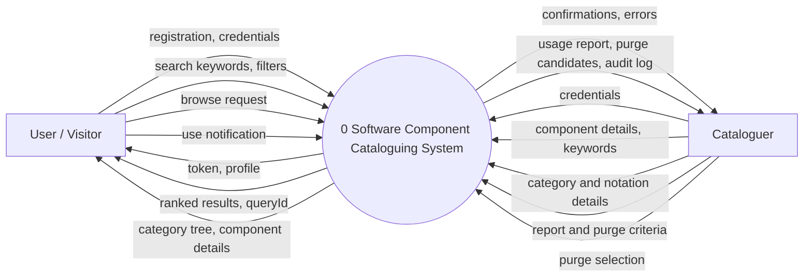
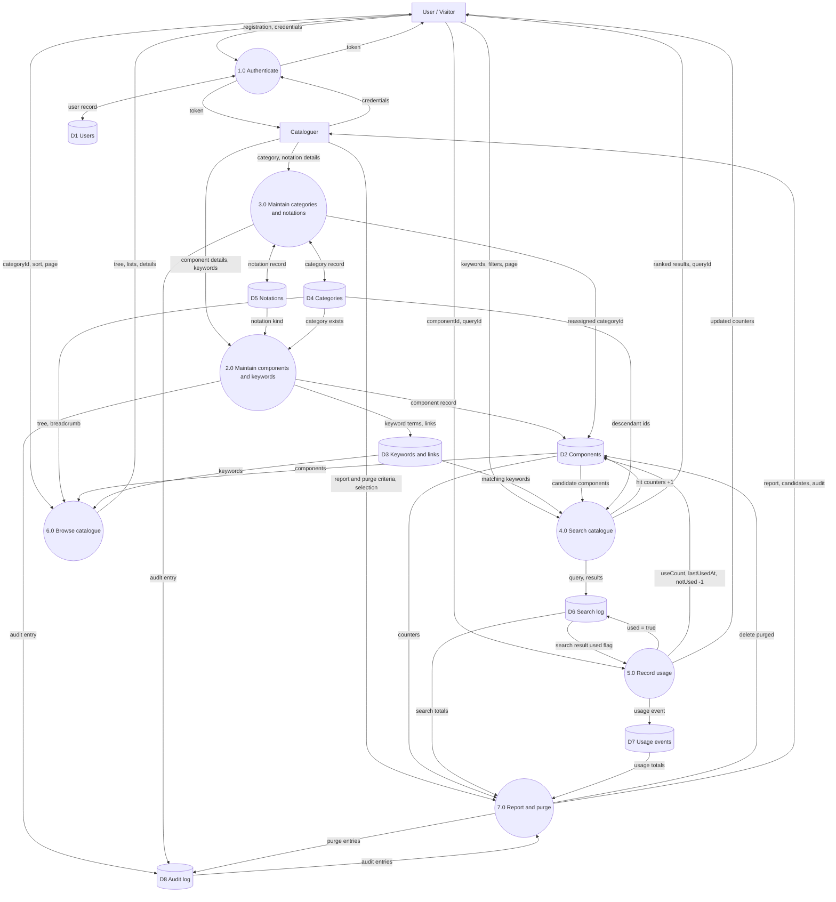

# Structured Analysis

Notation used in the diagrams: rectangles are external entities, rounded nodes are processes,
cylinders are data stores, edge labels are data flows.

## Context diagram (level 0 DFD)

## Level 1 DFD

## Data dictionary

Notation: `=` is composed of, `+` and, `[a | b]` either, `{x}` zero or more, `(x)` optional,
`1{x}10` between 1 and 10 occurrences.

### Data flows

| Name | Definition |
|---|---|
| registration | name + email + password |
| credentials | email + password |
| token | JWT string (claims: sub + role; expiry 1 day) |
| profile | userId + name + email + role |
| component details | name + description + kind + notationId + categoryId + (version) + (author) + (sourceUrl) + (content) + (keywords) |
| keywords | 1{term}50 |
| search keywords, filters | 1{term}10 + match + (kind) + (notationId) + (categoryId) + (includeDescendants) + (page) + (pageSize) |
| ranked results | queryId + {result item} + page + pageSize + total |
| result item | component summary + matchedKeywords + score |
| use notification | componentId + (queryId) |
| updated counters | useCount + queryHitCount + queryHitNotUsedCount + lastUsedAt |
| browse request | categoryId + (includeDescendants) + (sort) + (page) + (pageSize) |
| category details | name + (description) + (parentId) |
| notation details | name + kind |
| purge criteria | (maxUses) + (minNotUsedHits) + (unusedForDays) + (olderThanDays) |
| purge selection | 1{componentId} + purge criteria |
| usage report | totals + byKind + topUsed + topNotUsed + neverUsedCount |
| error | code + message + (details) |

### Data stores

| Store | Entity (Prisma) | Composition |
|---|---|---|
| D1 Users | User | id + name + email + passwordHash + role + createdAt |
| D2 Components | Component | id + name + description + kind + notationId + categoryId + version + (author) + (sourceUrl) + (content) + createdById + useCount + queryHitCount + queryHitNotUsedCount + (lastUsedAt) + createdAt + updatedAt |
| D3 Keywords and links | Keyword, ComponentKeyword | Keyword = id + term; ComponentKeyword = componentId + keywordId |
| D4 Categories | Category | id + name + slug + (description) + (parentId) + createdAt + updatedAt |
| D5 Notations | Notation | id + name + kind |
| D6 Search log | SearchQuery, SearchResult | SearchQuery = id + (userId) + terms + filters + resultCount + createdAt; SearchResult = queryId + componentId + rank + used |
| D7 Usage events | UsageEvent | id + componentId + (userId) + (queryId) + createdAt |
| D8 Audit log | AuditLog | id + actorId + action + entityType + entityId + (details) + createdAt |

### Elementary data items

| Item | Type / domain |
|---|---|
| id, userId, componentId, categoryId, notationId, keywordId, queryId, actorId | cuid string |
| name (user) | string, 1..100 chars |
| email | string, valid email, unique, stored lowercase |
| password | string, 8..72 chars (never stored) |
| passwordHash | bcrypt hash string |
| role | [CATALOGUER \| USER] |
| kind | [DESIGN \| CODE] |
| name (component, category, notation) | string, 1..120 chars, trimmed |
| description | string, 1..5000 chars (component); 0..1000 (category) |
| slug | lowercase letters, digits and hyphens derived from name |
| version | string, default "1.0.0" |
| sourceUrl | absolute http(s) URL |
| content | text, up to 100,000 chars |
| term | string, 1..50 chars, trimmed, lowercase |
| match | ["any" \| "all"] |
| sort | ["name" \| "newest" \| "mostUsed"] |
| page | integer >= 1, default 1 |
| pageSize | integer 1..50, default 20 |
| useCount, queryHitCount, queryHitNotUsedCount | integer >= 0, default 0 |
| score | integer >= 0 |
| rank | integer >= 1, position in the whole ordered result |
| used | boolean, default false |
| maxUses, minNotUsedHits, unusedForDays, olderThanDays | integer >= 0 |
| action | [COMPONENT_CREATE \| COMPONENT_UPDATE \| COMPONENT_DELETE \| COMPONENT_PURGE \| KEYWORDS_UPDATE \| CATEGORY_CREATE \| CATEGORY_UPDATE \| CATEGORY_DELETE \| NOTATION_CREATE] |
| createdAt, updatedAt, lastUsedAt | timestamp with time zone |

## Structure chart

Derived by transaction analysis of the level 1 DFD: the API router is the transaction centre that
dispatches to one module per process. Edge labels are data couples; `ok/err` is a control flag.

```mermaid
flowchart TB
    M["Main: API request dispatcher"]

    A["Authenticate request"]
    V["Validate input"]
    R["Format response or error"]

    P1["1.0 Register / Login"]
    P2["2.0 Maintain component"]
    P3["3.0 Maintain category / notation"]
    P4["4.0 Search catalogue"]
    P5["5.0 Record use"]
    P6["6.0 Browse catalogue"]
    P7["7.0 Report / purge"]

    P2a["Check notation kind"]
    P2b["Normalise and upsert keywords"]
    P2c["Write audit entry"]
    P3a["Check cycle and sibling name"]
    P3b["Reassign children and components"]
    P4a["Resolve descendant categories"]
    P4b["Score and order components"]
    P4c["Record query and hit counters"]
    P5a["Mark search result used"]
    P5b["Increment use counters"]
    P7a["Compute summary"]
    P7b["Select purge candidates"]
    P7c["Delete candidates"]

    M -->|"headers / user, role"| A
    M -->|"raw body / parsed dto, ok/err"| V
    M -->|"dispatch"| P1
    M -->|"dispatch"| P2
    M -->|"dispatch"| P3
    M -->|"dispatch"| P4
    M -->|"dispatch"| P5
    M -->|"dispatch"| P6
    M -->|"dispatch"| P7
    M -->|"result or error / http response"| R

    P2 -->|"kind, notationId / ok/err"| P2a
    P2 -->|"terms / keywordIds"| P2b
    P2 -->|"action, entity"| P2c
    P3 -->|"categoryId, parentId, name / ok/err"| P3a
    P3 -->|"fromId, toId"| P3b
    P3 -->|"action, entity"| P2c
    P4 -->|"categoryId / categoryIds"| P4a
    P4 -->|"terms, match, filters / scored list"| P4b
    P4 -->|"terms, page items / queryId"| P4c
    P5 -->|"queryId, componentId / decrement flag"| P5a
    P5 -->|"componentId, decrement flag / counters"| P5b
    P6 -->|"categoryId / categoryIds"| P4a
    P7 -->|"none / summary"| P7a
    P7 -->|"criteria / candidate list"| P7b
    P7 -->|"ids, criteria / deleted, skipped"| P7c
    P7c -->|"action, entity"| P2c
```

