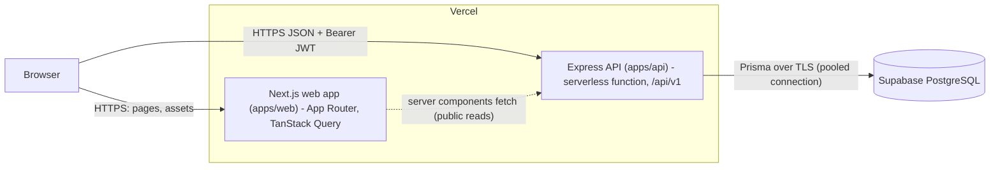
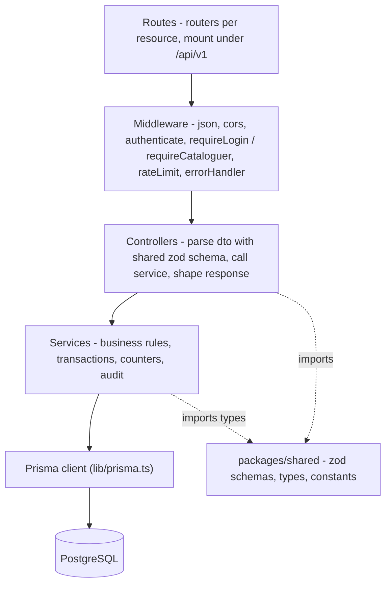
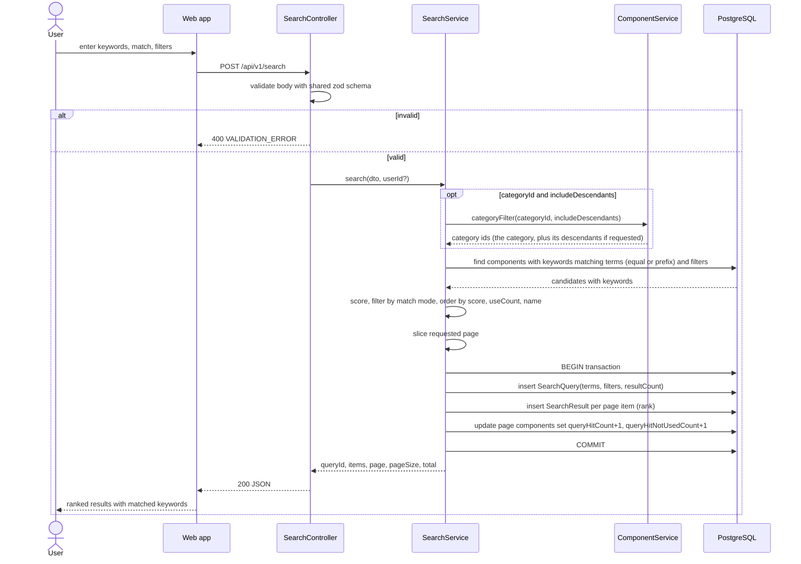
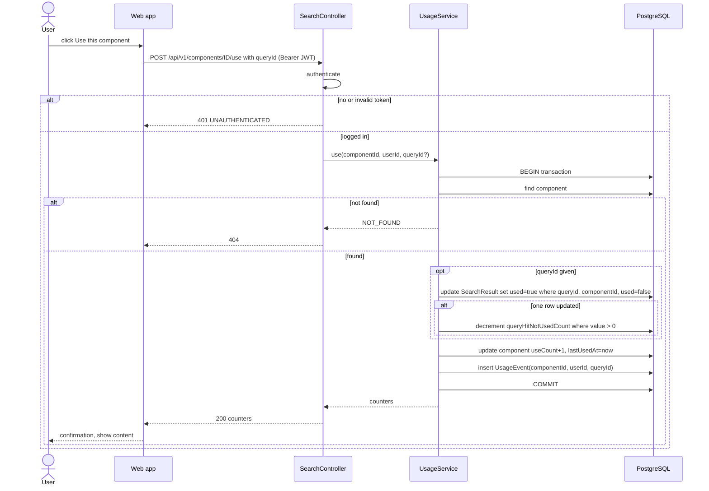
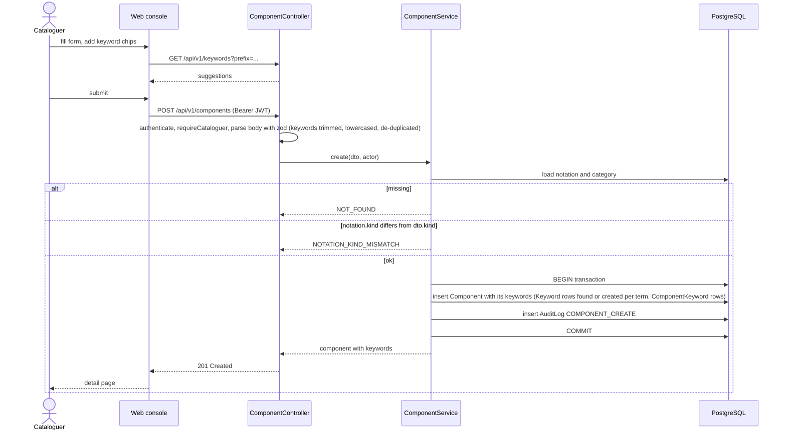
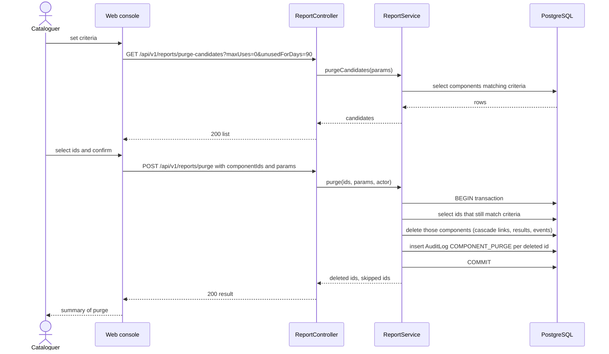
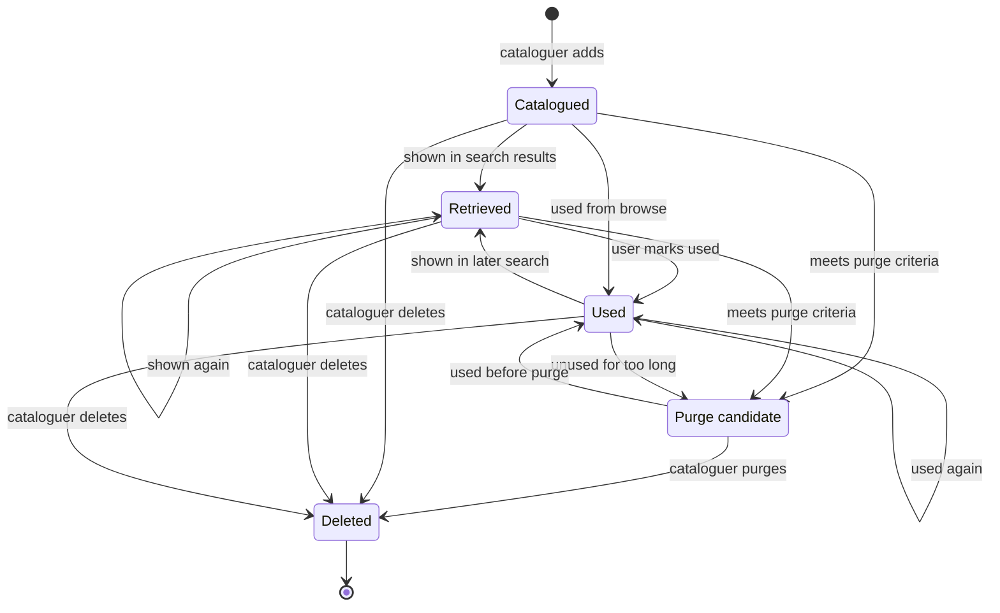
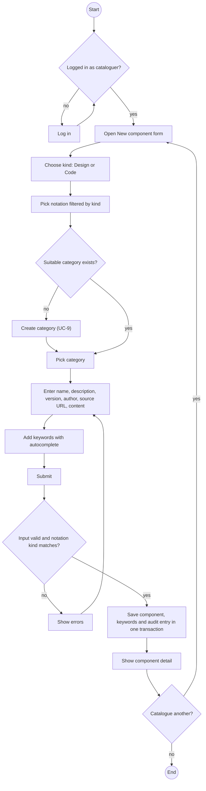

# Design

Data model names, API paths and counter rules are defined in `CLAUDE.md`; this document shows
how they fit together.

## 1. Architecture



- The browser calls the API directly for authenticated and mutating requests (token kept in
  memory + `localStorage`); Next.js server components may call public read endpoints for SSR.
- CORS on the API allows the origins in `WEB_ORIGIN`, `http://localhost:*` and `*.vercel.app` (everything if
  `WEB_ORIGIN` is unset or contains `*`); other browsers' origins get no CORS headers.
- Supabase's pooled connection string (`DATABASE_URL`, Supavisor port 6543 with
  `?pgbouncer=true`) is used at runtime; the direct string (port 5432)
  (`DIRECT_URL`) is used by `prisma migrate`.
- `packages/shared` is compiled into both apps: zod schemas are the single definition of
  request shapes, and the web forms reuse them for client-side validation.

## 2. Layered backend design



| Layer | Responsibility | May import |
|---|---|---|
| routes | HTTP method + path -> middleware chain -> controller | middleware, controllers |
| middleware | auth (JWT -> `req.user`), role check, rate limit, error -> JSON shape | services (`verifyToken` only), errors |
| controllers | parse `req` with the shared zod schema (there is no separate validate middleware), call the service, `res.status().json()` | services, shared |
| services | all logic; `prisma.$transaction` for multi-write operations; throw `AppError` | prisma, shared, errors |
| lib/prisma | single `PrismaClient` instance | - |

Source layout (as built):

```
apps/api/src/
  app.ts                 express app (no listen) used by tests and the Vercel handler
  index.ts               local dev server
  serverless.ts          Vercel handler
  routes/{auth,categories,components,health,keywords,notations,reports,search}.ts
  controllers/{auth,category,component,keyword,notation,report,search}.controller.ts
  services/{audit,auth,category,component,health,keyword,notation,report,search,usage}.service.ts
  middleware/{auth,errorHandler,rateLimit}.ts
  lib/prisma.ts  errors.ts
apps/api/prisma/{schema.prisma, seed.ts, migrations/}
apps/web/app/            (public) /, /search, /browse/[[...id]], /components/[id], /login, /register
                         (console) /console (reports dashboard), /console/components,
                                   /console/categories, /console/notations, /console/purge,
                                   /console/audit
packages/shared/src/{schemas,types,constants}.ts
```

## 3. ER diagram


Indexes planned: `Component(categoryId)`, `Component(notationId)`,
`Component(kind)`, `ComponentKeyword(keywordId)`, `Keyword(term)` (unique, also used with
`text_pattern_ops` for prefix search), `UsageEvent(componentId)`, `AuditLog(createdAt)`.

## 4. Class diagrams

Two class diagrams, both drawn in PlantUML (sources and exports in `diagrams/`, see
`diagrams/README.md`): the **domain model** (the data the system stores) and the **backend design**
(the code that works on it).

### 4.1 Domain model


Source: `diagrams/class-domain.puml`, derived from `apps/api/prisma/schema.prisma`. Attributes show
the stored type; `[0..1]` marks optional fields. The two enumerations `Role` and `ComponentKind` are
used as attribute types (`User.role`, `Notation.kind`, `Component.kind`).

| Relationship | UML kind | Multiplicity | Why it is drawn this way |
|---|---|---|---|
| User creates Component | association | 1 to 0..* | `Component.createdById` is required. |
| Category classifies Component | association | 1 to 0..* | `Component.categoryId` is required, so a component is in exactly one category. |
| Notation expresses Component | association | 1 to 0..* | `Component.notationId` is required; the kind of the notation must equal the kind of the component (checked in the service). |
| Category has parent / children | aggregation, self-association | 0..1 parent to 0..* children | A category groups sub-categories, but a parent cannot be deleted while it still has children: they are reassigned first (`CATEGORY_NOT_EMPTY`). The children live on, so this is aggregation and not composition. |
| Component described by Keyword | many-to-many with association class `ComponentKeyword` | 0..* to 0..* | The link row has its own identity (`componentId`, `keywordId`) and is deleted with the component (cascade). |
| SearchQuery returns Component | many-to-many with association class `SearchResult` | 0..* to 0..* | The link carries data of its own, `rank` and `used`; it is what the "hit not used" counter is built from. It is deleted with either end (cascade). |
| Component has UsageEvent | composition | 1 to 0..* | A usage event has no meaning without its component and is deleted with it (cascade). |
| User runs SearchQuery, User triggers UsageEvent | association | 0..1 to 0..* | `userId` is optional: anonymous visitors can search, and the rows survive when a user is deleted (`SetNull`). |
| SearchQuery led to UsageEvent | association | 0..1 to 0..* | `queryId` is optional: a use may come from a search or from a detail page. |
| User performs AuditLog | association | 1 to 0..* | `AuditLog.actorId` is required. |

There is no inheritance in the domain model. `Role` is an attribute of `User`, not a subclass, because
the two kinds of user have the same data and differ only in what they may do.

### 4.2 Backend design


Source: `diagrams/class-backend.puml`. A request goes routes, then middleware, controllers, services
and the database, as in section 2. The arrows are the real imports:

- Routes attach middleware (`authenticate` globally, `requireLogin` / `requireCataloguer` per route,
  `rateLimit` on the two auth routes) and call one controller. The health route calls `HealthService`
  directly and has no controller.
- `auth` middleware depends on `AuthService.verifyToken` to turn the Bearer token into `req.user`.
- Controllers call services. Two controllers call two services each: `ComponentController` (component and
  keyword) and `SearchController` (search and usage).
- Service-to-service dependencies: `ComponentService` uses `CategoryService` (existence check,
  breadcrumb, descendants), `SearchService` uses `ComponentService` (category filter, result summary),
  and every service that writes to the catalogue calls `AuditService.audit` inside its own transaction.
- `AuditService.audit` receives the caller's transaction client, so it does not import Prisma. Every other
  service imports the single `PrismaClient` and throws `AppError` for business errors.

The services are **modules of exported functions**, not classes with state. They are drawn as
`«service»` classes because the diagram shows what each module offers and what it depends on. The
`+` operations are the exported functions.

Notation management sits in its own `NotationService` (create and list), and reports and the audit
log are both in `ReportService`.

## 5. Sequence diagrams

### 5.1 Keyword search



### 5.2 Use component



### 5.3 Add component with keywords



### 5.4 Purge



## 6. Component lifecycle (state diagram)

The state is derived from counters and purge criteria; it is not stored as a column.



## 7. Activity diagram — cataloguing a component


