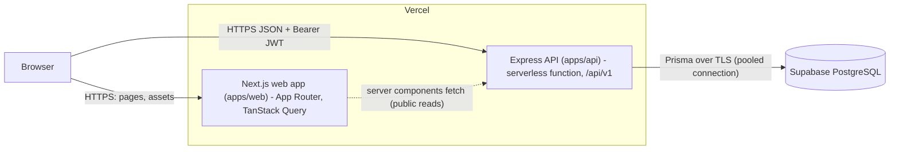
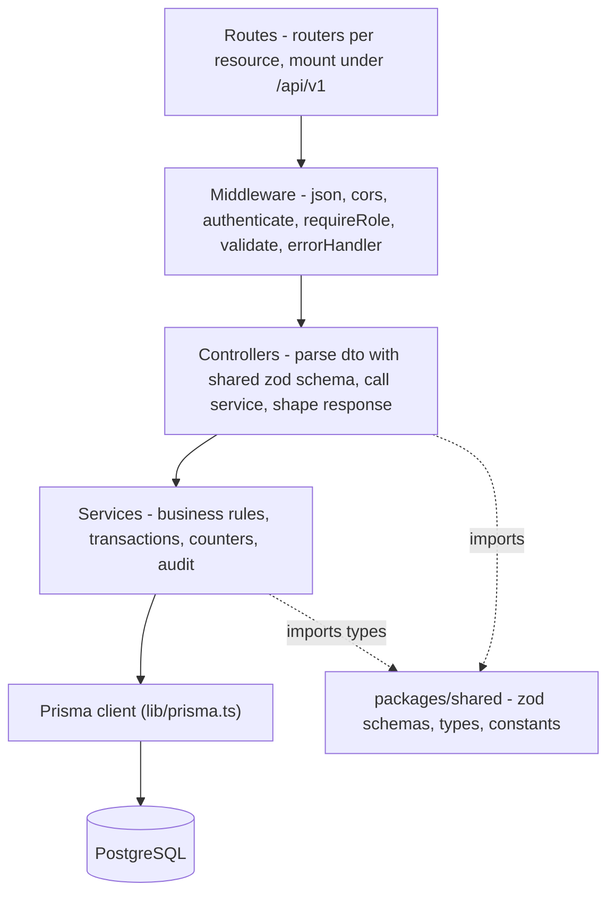
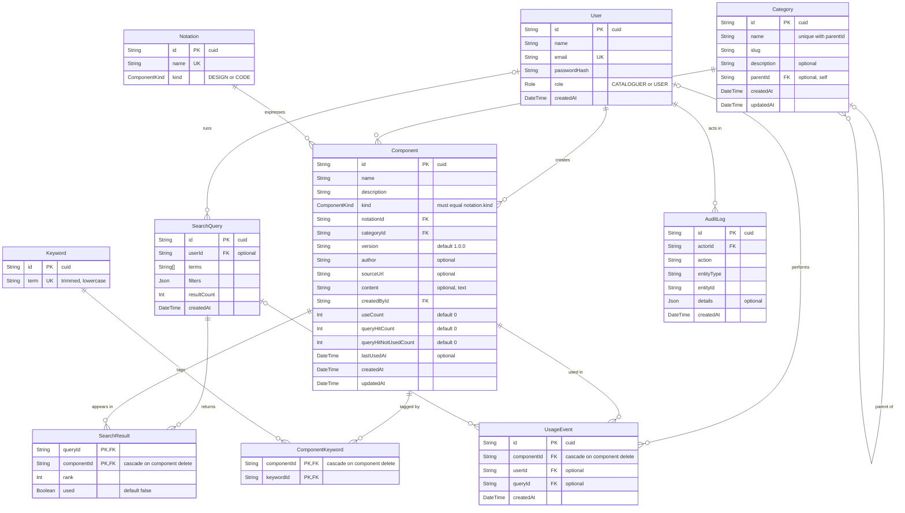
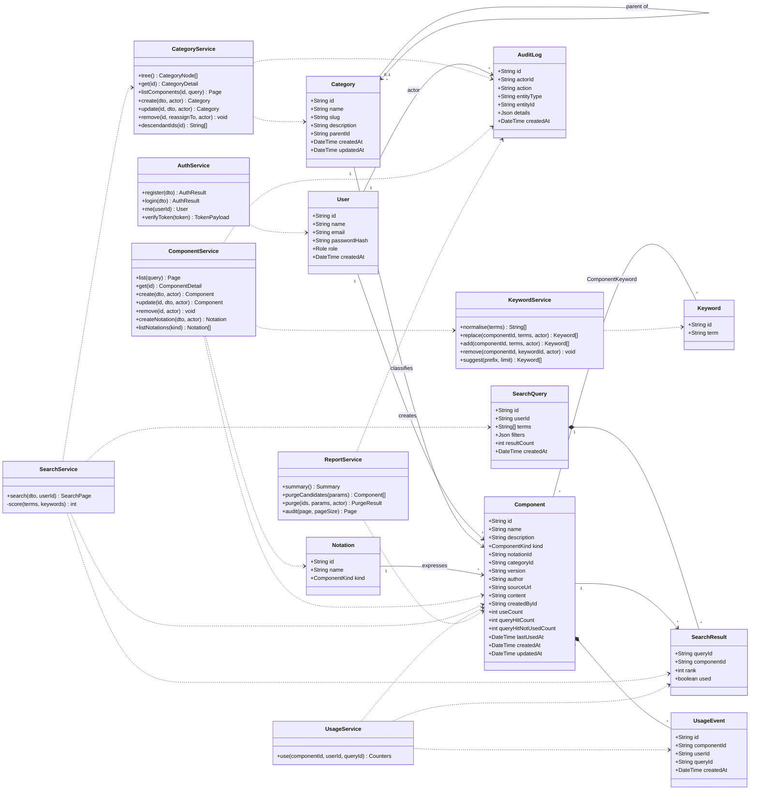
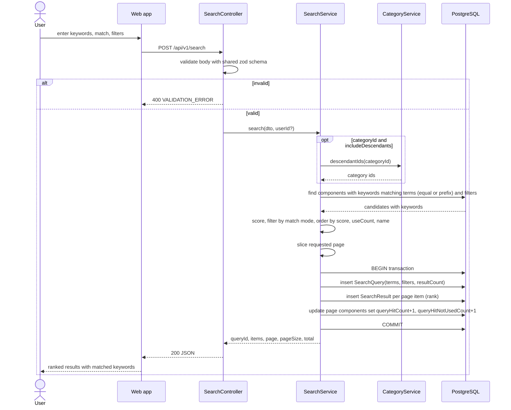
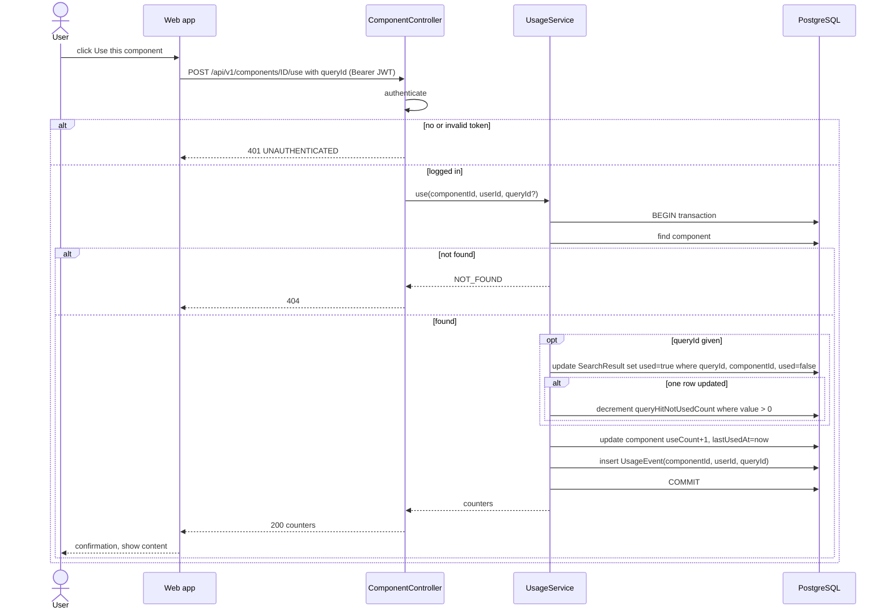
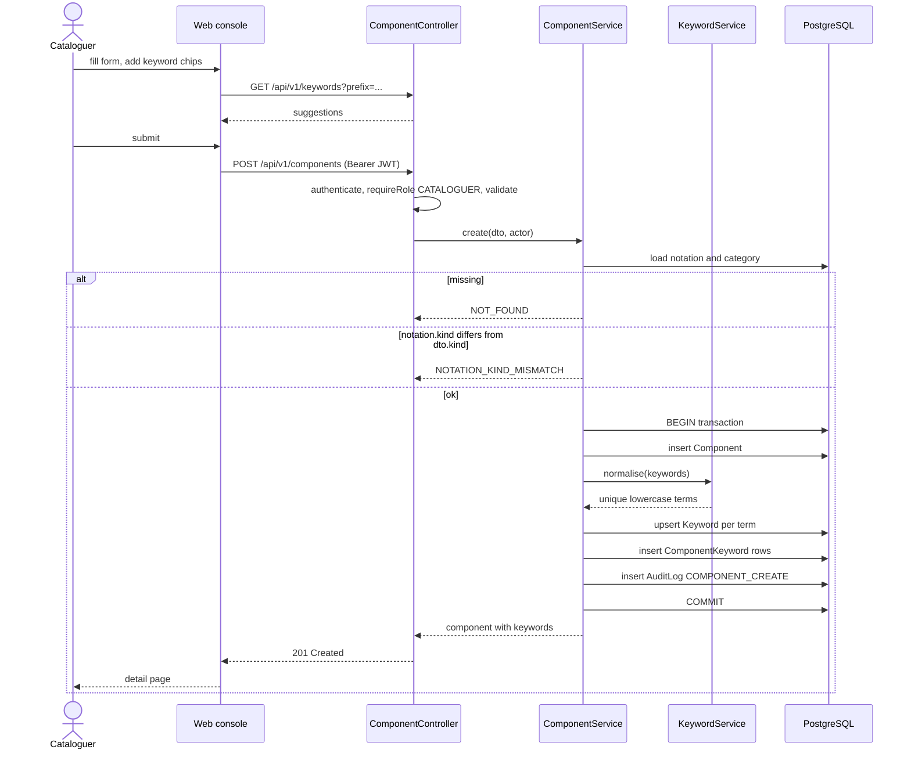
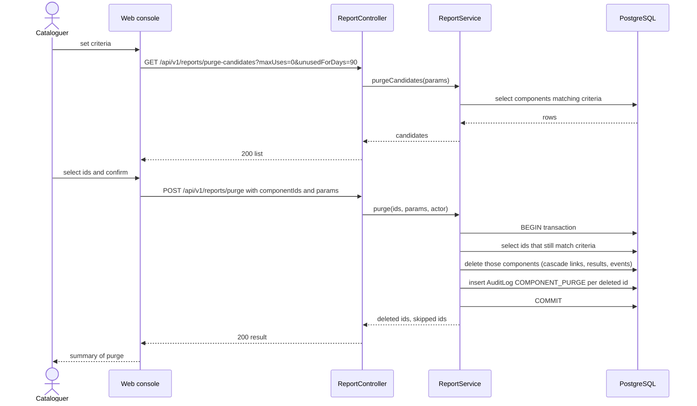
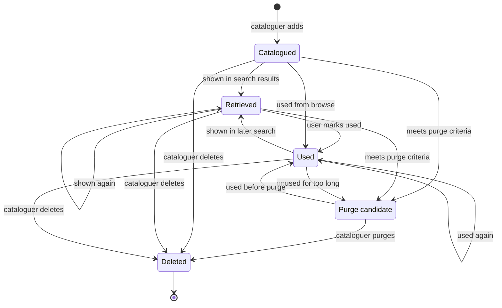
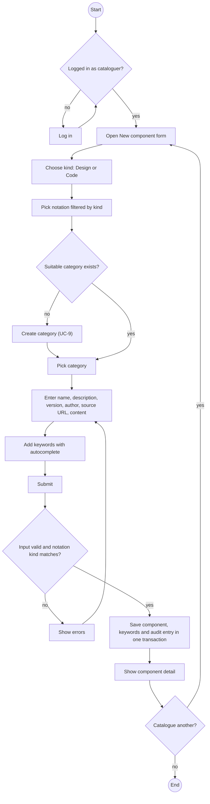

# Design

Data model names, API paths and counter rules are defined in `CLAUDE.md`; this document shows
how they fit together.

## 1. Architecture



- The browser calls the API directly for authenticated and mutating requests (token kept in
  memory + `localStorage`); Next.js server components may call public read endpoints for SSR.
- CORS on the API allows only `WEB_ORIGIN`.
- Supabase's pooled connection string (`DATABASE_URL`, Supavisor port 6543 with
  `?pgbouncer=true`) is used at runtime; the direct string (port 5432)
  (`DIRECT_URL`) is used by `prisma migrate`.
- `packages/shared` is compiled into both apps: zod schemas are the single definition of
  request shapes, and the web forms reuse them for client-side validation.

## 2. Layered backend design



| Layer | Responsibility | May import |
|---|---|---|
| routes | HTTP method + path -> middleware chain -> controller | middleware, controllers |
| middleware | auth (JWT -> `req.user`), role check, zod validation, error -> JSON shape | shared, errors |
| controllers | read `req`, call exactly one service method, `res.status().json()` | services, shared |
| services | all logic; `prisma.$transaction` for multi-write operations; throw `AppError` | prisma, shared, errors |
| lib/prisma | single `PrismaClient` instance | - |

Planned source layout:

```
apps/api/src/
  app.ts                 express app (no listen) used by tests and the Vercel handler
  index.ts               local dev server
  routes/{auth,categories,notations,components,keywords,search,reports}.ts
  controllers/*.controller.ts
  services/{auth,category,notation,component,keyword,search,usage,report,audit}.service.ts
  middleware/{authenticate,requireRole,validate,errorHandler}.ts
  lib/prisma.ts  errors.ts
apps/api/prisma/{schema.prisma, seed.ts, migrations/}
apps/web/app/            (public) /, /search, /browse/[[...id]], /components/[id], /login, /register
                         (console) /console/components, /console/categories, /console/notations,
                                   /console/reports, /console/purge, /console/audit
packages/shared/src/{schemas,types,constants}.ts
```

## 3. ER diagram



Indexes planned: `Component(categoryId)`, `Component(notationId)`,
`Component(kind)`, `ComponentKeyword(keywordId)`, `Keyword(term)` (unique, also used with
`text_pattern_ops` for prefix search), `UsageEvent(componentId)`, `AuditLog(createdAt)`.

## 4. Class diagram



Notation management lives in `ComponentService` (it is only a lookup table); audit writes are a
small helper called inside each service's transaction.

## 5. Sequence diagrams

### 5.1 Keyword search



### 5.2 Use component



### 5.3 Add component with keywords



### 5.4 Purge



## 6. Component lifecycle (state diagram)

The state is derived from counters and purge criteria; it is not stored as a column.



## 7. Activity diagram — cataloguing a component


