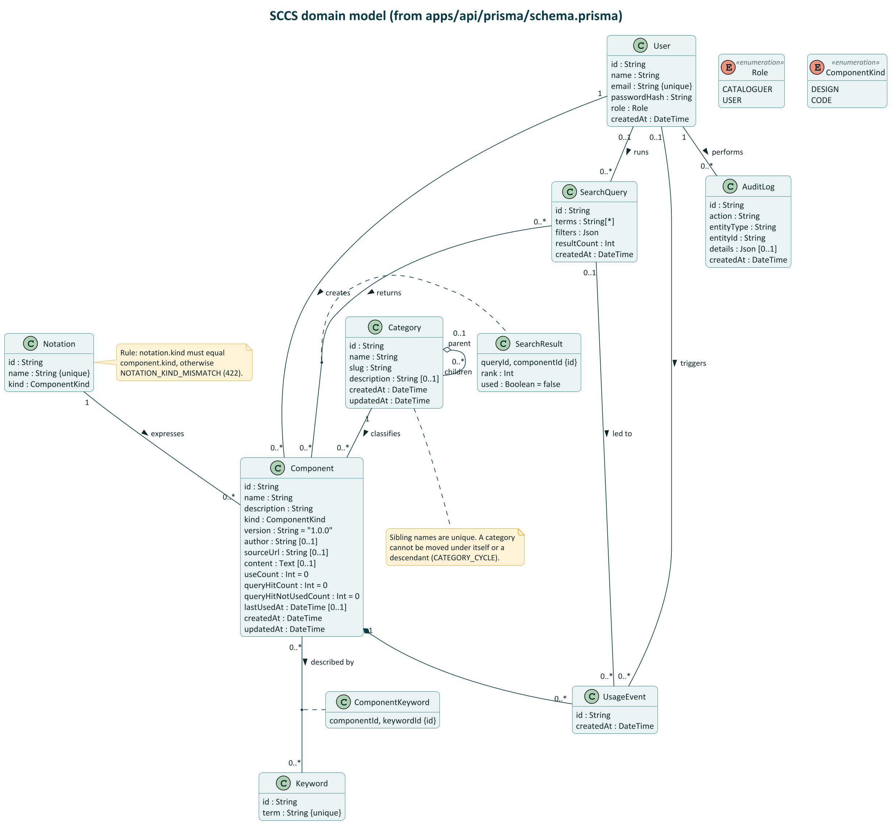
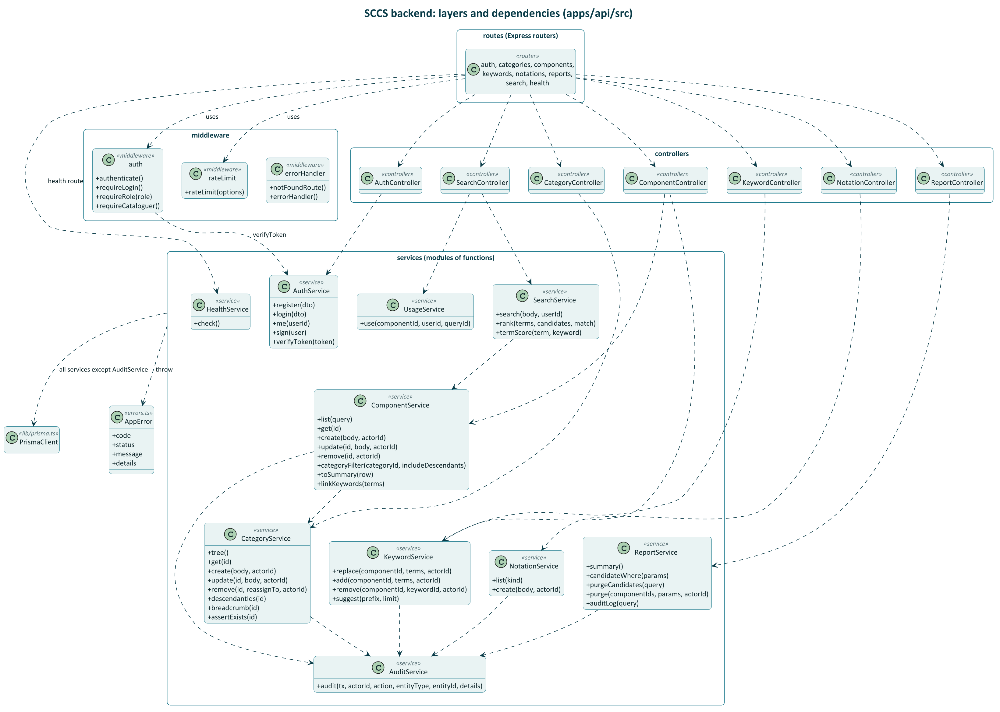

# Design

Data model names, API paths and counter rules are defined in `CLAUDE.md`; this document shows
how they fit together.

## 1. Architecture

**System flow:**
- Browser calls **Next.js web app** (Vercel) for pages and assets over HTTPS
- Browser calls **Express API** (Vercel) directly for authenticated requests (Bearer JWT in header, stored in `localStorage`)
- Next.js server components can fetch public read endpoints from the API for SSR
- API connects to **Supabase PostgreSQL** via Prisma over TLS (pooled connection at runtime for speed, direct connection for migrations)

**Security & deployment:**
- CORS on the API allows origins in `WEB_ORIGIN`, `http://localhost:*`, and `*.vercel.app` (all origins if `WEB_ORIGIN` unset or contains `*`)
- `packages/shared` is compiled into both apps: zod schemas validate request shapes in controllers and client-side form validation

## 2. Layered backend design

**Request flow (layered architecture):**

```
HTTP Request
    ↓
Routes (attach middleware chain)
    ↓
Middleware (authenticate JWT, check role, rate limit, error handling)
    ↓
Controllers (parse request with Zod schema, call service, return JSON)
    ↓
Services (all business logic: search ranking, counter updates, transactions, audit)
    ↓
Prisma (type-safe database access)
    ↓
PostgreSQL (persistence)
```

All layers share validation schemas and types from `packages/shared`.

| Layer | Responsibility | May import |
|---|---|---|
| routes | HTTP method + path -> middleware chain -> controller | middleware, controllers |
| middleware | auth (JWT -> `req.user`), role check, rate limit, error -> JSON shape | services (`verifyToken` only), errors |
| controllers | parse `req` with the shared zod schema (there is no separate validate middleware), call the service, `res.status().json()` | services, shared |
| services | all logic; `prisma.$transaction` for multi-write operations; throw `AppError` | prisma, shared, errors |
| lib/prisma | single `PrismaClient` instance | - |

Source layout (as built):

```
apps/api/src/
  app.ts                 express app (no listen) used by tests and the Vercel handler
  index.ts               local dev server
  serverless.ts          Vercel handler
  routes/{auth,categories,components,health,keywords,notations,reports,search}.ts
  controllers/{auth,category,component,keyword,notation,report,search}.controller.ts
  services/{audit,auth,category,component,health,keyword,notation,report,search,usage}.service.ts
  middleware/{auth,errorHandler,rateLimit}.ts
  lib/prisma.ts  errors.ts
apps/api/prisma/{schema.prisma, seed.ts, migrations/}
apps/web/app/            (public) /, /search, /browse/[[...id]], /components/[id], /login, /register
                         (console) /console (reports dashboard), /console/components,
                                   /console/categories, /console/notations, /console/purge,
                                   /console/audit
packages/shared/src/{schemas,types,constants}.ts
```

## 3. ER diagram


Indexes planned: `Component(categoryId)`, `Component(notationId)`,
`Component(kind)`, `ComponentKeyword(keywordId)`, `Keyword(term)` (unique, also used with
`text_pattern_ops` for prefix search), `UsageEvent(componentId)`, `AuditLog(createdAt)`.

## 4. Class diagrams

Two class diagrams, both drawn in PlantUML (sources and exports in `diagrams/`, see
`diagrams/README.md`): the **domain model** (the data the system stores) and the **backend design**
(the code that works on it).

### 4.1 Domain model



Source: `diagrams/class-domain.puml`, derived from `apps/api/prisma/schema.prisma`. Attributes show
the stored type; `[0..1]` marks optional fields. The two enumerations `Role` and `ComponentKind` are
used as attribute types (`User.role`, `Notation.kind`, `Component.kind`).

| Relationship | UML kind | Multiplicity | Why it is drawn this way |
|---|---|---|---|
| User creates Component | association | 1 to 0..* | `Component.createdById` is required. |
| Category classifies Component | association | 1 to 0..* | `Component.categoryId` is required, so a component is in exactly one category. |
| Notation expresses Component | association | 1 to 0..* | `Component.notationId` is required; the kind of the notation must equal the kind of the component (checked in the service). |
| Category has parent / children | aggregation, self-association | 0..1 parent to 0..* children | A category groups sub-categories, but a parent cannot be deleted while it still has children: they are reassigned first (`CATEGORY_NOT_EMPTY`). The children live on, so this is aggregation and not composition. |
| Component described by Keyword | many-to-many with association class `ComponentKeyword` | 0..* to 0..* | The link row has its own identity (`componentId`, `keywordId`) and is deleted with the component (cascade). |
| SearchQuery returns Component | many-to-many with association class `SearchResult` | 0..* to 0..* | The link carries data of its own, `rank` and `used`; it is what the "hit not used" counter is built from. It is deleted with either end (cascade). |
| Component has UsageEvent | composition | 1 to 0..* | A usage event has no meaning without its component and is deleted with it (cascade). |
| User runs SearchQuery, User triggers UsageEvent | association | 0..1 to 0..* | `userId` is optional: anonymous visitors can search, and the rows survive when a user is deleted (`SetNull`). |
| SearchQuery led to UsageEvent | association | 0..1 to 0..* | `queryId` is optional: a use may come from a search or from a detail page. |
| User performs AuditLog | association | 1 to 0..* | `AuditLog.actorId` is required. |

There is no inheritance in the domain model. `Role` is an attribute of `User`, not a subclass, because
the two kinds of user have the same data and differ only in what they may do.

### 4.2 Backend design



Source: `diagrams/class-backend.puml`. A request goes routes, then middleware, controllers, services
and the database, as in section 2. The arrows are the real imports:

- Routes attach middleware (`authenticate` globally, `requireLogin` / `requireCataloguer` per route,
  `rateLimit` on the two auth routes) and call one controller. The health route calls `HealthService`
  directly and has no controller.
- `auth` middleware depends on `AuthService.verifyToken` to turn the Bearer token into `req.user`.
- Controllers call services. Two controllers call two services each: `ComponentController` (component and
  keyword) and `SearchController` (search and usage).
- Service-to-service dependencies: `ComponentService` uses `CategoryService` (existence check,
  breadcrumb, descendants), `SearchService` uses `ComponentService` (category filter, result summary),
  and every service that writes to the catalogue calls `AuditService.audit` inside its own transaction.
- `AuditService.audit` receives the caller's transaction client, so it does not import Prisma. Every other
  service imports the single `PrismaClient` and throws `AppError` for business errors.

The services are **modules of exported functions**, not classes with state. They are drawn as
`«service»` classes because the diagram shows what each module offers and what it depends on. The
`+` operations are the exported functions.

Notation management sits in its own `NotationService` (create and list), and reports and the audit
log are both in `ReportService`.

## 5. Sequence diagrams

See `diagrams/` folder for full PlantUML sequence diagrams (PNG and SVG):

### 5.1 Keyword search (`seq-search.puml`)

**Flow:**
- User enters keywords, match mode, and optional filters
- Web app calls `POST /search` with Zod-validated request
- SearchController calls SearchService
- SearchService validates, filters by category/kind/notation, ranks components by keyword match
- For each component on the returned page: increments counters (queryHitCount, queryHitNotUsedCount), creates SearchResult row
- All counter updates in one Prisma transaction
- Returns paginated results with rank and matched keywords

### 5.2 Use component (`seq-use.puml`)

**Flow:**
- User clicks "Use this component" on a search result or detail page (requires login)
- Web app sends `POST /components/:id/use` with optional queryId
- Backend middleware authenticates JWT token
- UsageService increments useCount, sets lastUsedAt, creates UsageEvent
- If queryId provided and SearchResult exists for this component: sets used=true and decrements queryHitNotUsedCount
- All changes in one transaction
- Returns updated counters

### 5.3 Add component with keywords (`seq-add.puml`)

**Flow:**
- Cataloguer fills component form (name, description, kind, notation, category, version, keywords)
- Web console calls keyword autocomplete endpoint for suggestions
- On submit: `POST /components` with Zod-validated body
- Middleware checks authentication + requires CATALOGUER role
- ComponentService loads notation and category, validates kind matches
- Creates Component row, finds/creates Keyword rows, links via ComponentKeyword
- Creates AuditLog entry COMPONENT_CREATE
- All in one transaction
- Returns component detail

### 5.4 Purge (`seq-purge.puml`)

**Flow:**
- Cataloguer opens purge tool and sets criteria (maxUses, minNotUsedHits, unusedForDays, olderThanDays)
- Web console calls `GET /reports/purge-candidates?...params...`
- ReportService queries components matching all criteria
- Shows candidates to the cataloguer for review
- Cataloguer selects components and confirms purge
- Web console calls `POST /reports/purge` with selected componentIds and params
- ReportService re-checks criteria server-side (snapshot attack prevention)
- Deletes matching components (cascades to keywords, results, usage events)
- Creates one AuditLog entry per deletion with COMPONENT_PURGE action
- All in one transaction
- Returns list of deleted and skipped component IDs

## 6. Component lifecycle

The state is derived from counters and purge criteria; it is not stored as a column.

**States:**
- **Catalogued:** Component added by cataloguer, never appeared in search or used
- **Retrieved:** Component appeared in at least one search (queryHitCount > 0)
- **Used:** Component marked as used at least once (useCount > 0)
- **PurgeCandidate:** Matches all purge criteria (useCount ≤ maxUses, queryHitNotUsedCount ≥ minNotUsedHits, lastUsedAt is null or older than unusedForDays, createdAt older than olderThanDays)
- **Deleted:** Component was deleted by cataloguer or purged

**Transitions:**
- Catalogued → Retrieved: component shown in a search
- Retrieved → Used: user marks it used from search result
- Catalogued → Used: user marks it used from browse/detail page (no prior search)
- Any state → PurgeCandidate: criteria met during purge check
- PurgeCandidate → Used: component used before purge is executed (transitions back to Used)
- Any state → Deleted: cataloguer manually deletes it, or purge is executed on PurgeCandidate

## 7. Activity — Cataloguing a component (UC-2 and UC-5)

**Steps:**
1. Check login: if not logged in as cataloguer, log in first
2. Open new component form
3. Choose kind: Design or Code
4. Pick notation filtered by kind (notation.kind must equal component.kind)
5. Check if suitable category exists:
   - If no: create a new category (see UC-9) and pick it
   - If yes: pick the existing category
6. Enter component details (name, description, version, author, source URL, content)
7. Add keywords using autocomplete suggestions (keywords stored trimmed, lowercase, unique)
8. Submit form
9. Validate:
   - If invalid: show errors, user returns to step 6
   - If valid and notation.kind matches component.kind: proceed
10. Save component, all keywords, and audit entry in **one transaction**
11. Show component detail page
12. Ask if cataloguing another:
    - If yes: return to step 2
    - If no: end
